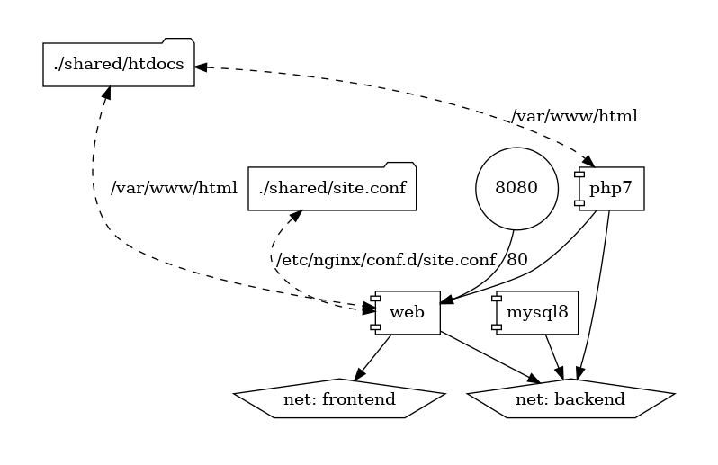
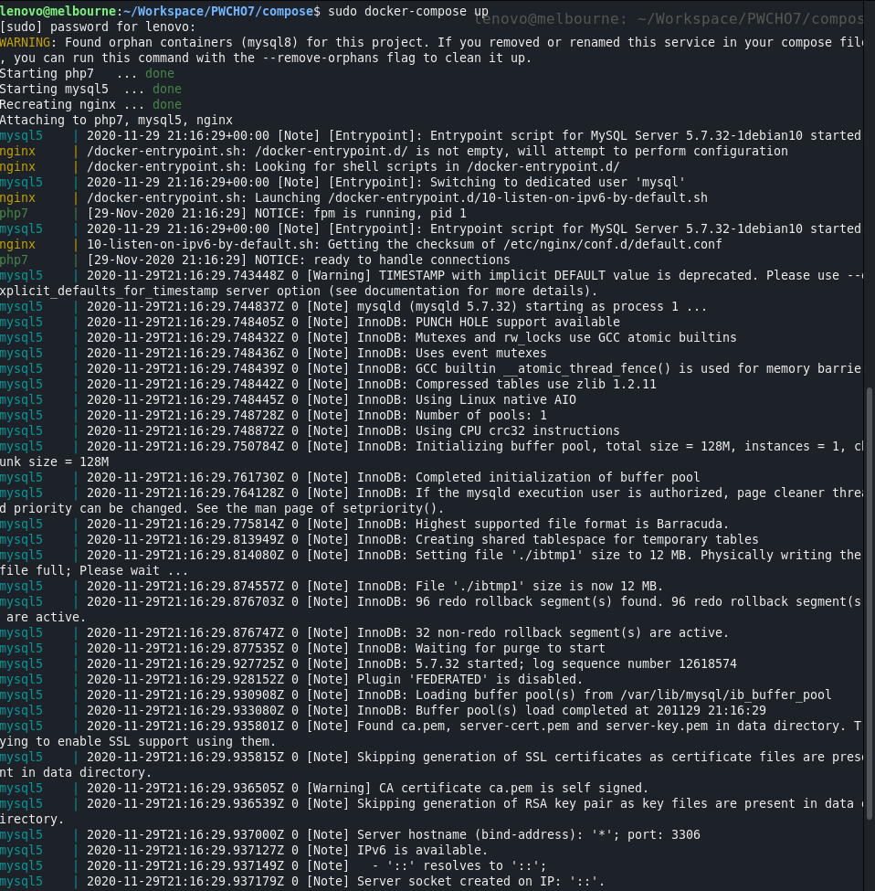
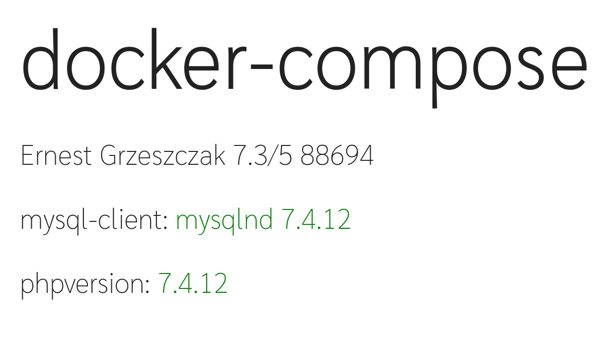

# Sprawozdanie PwChO: `docker-compose`

### Ernest Grzeszczak 7.3/5 88694

</br>



## Uruchamianie

### Budowanie projektu
```sh
$ sudo docker-compose build
$ sudo docker-compose up
```
### Otworz
```sh
$ curl 127.0.0.1:6666
```
albo
```sh
$ firefox 127.0.0.1:6666
```

## Drzewo projektu
```sh
lenovo@melbourne:~/Workspace/PWCHO7/compose$ tree
.
├── docker-compose.yaml # Plik yaml
├── db # Folder dla MySQL
│   └── Dockerfile
├── php # Folder dla PHP
│   └── Dockerfile
├── shared # Folder z plikami
│   ├── htdocs # Wiadomo
│   │   └── index.php # Skrypt .php
│   └── site.conf
└── web # Folder dla Nginx
    └── Dockerfile
```

## Podać zawartość plików Dockerfile dla każdej usługi cząstkowej
- `/web/Dockerfile` (Dockerfile dla serwera nginx)
```Dockerfile
FROM nginx:alpine
RUN apk update
RUN apk upgrade
```
- `/php/Dockerfile` (Dockerfile dla serwera PHP)
```Dockerfile
FROM php:7-fpm-alpine
RUN apk update
RUN apk upgrade
RUN docker-php-ext-install mysqli && docker-php-ext-enable mysqli
```
- `/db/Dockerfile` (Dockerfile dla serwera MySQL)
```Dockerfile
FROM mysql:5.7
RUN apt-get update -y
```

## Podać zawartość innych, niezbędnych plików
W folderze shared znajduje sie plik `/htdocs/index.php` ktory bedziemy umieszczac w plikach nginx
```php
...
<div class="page-container">
    <div class="page">
        <h1>docker-compose</h1>
        <p>Ernest Grzeszczak 7.3/5 88694</p>
        <p>mysql-client: 
            <?php 
                if($link = mysqli_connect('mysql5', 'admin', 'admin')){
                    echo "<span style='color: green'>".$link->client_info."</span>";
                } else {
                    echo "ERROR";
                }
            ?>
        </p>
        <p>
            phpversion:     
            <?php
                // PHP Check
                echo "<span style='color: green'>".phpversion()."</span>";;
            ?>  
        </p>
    </div>
</div>
...
```
Natomiast w pliku `site.conf` bedziemy mieli konfiguracje dla naszego serwera nginx,
aby skonfigurowac obsluge plikow `.php`
```conf
server {
    listen 80;
    index index.php;
    server_name 127.0.0.1;
    root /var/www/html/;

    location ~ \.php$ {
        try_files $uri =404;
        fastcgi_split_path_info ^(.+\.php)(/.+)$;
        fastcgi_pass php7:9000;
        fastcgi_index index.php;
        include fastcgi_params;
        fastcgi_param SCRIPT_FILENAME $document_root$fastcgi_script_name;
        fastcgi_param PATH_INFO $fastcgi_path_info;
    }
}
```


## Podac zawartosc pliku `docker-compose.yaml`
```yaml
version: "3.7"

# Definicja sieci
networks:
  frontend:
    name: frontend
    driver: bridge
  backend:
    name: backend
    driver: bridge

services: 
  # Serwer nginx
  web:
    build:
      context: ./web
      dockerfile: Dockerfile
    image: web:6z1
    container_name: nginx
    ports:
      - "6666:80"
    volumes:
      - ./shared/htdocs:/var/www/html
      - ./shared/site.conf:/etc/nginx/conf.d/site.conf
    links:
      - php7
    networks:
      - frontend
      - backend

  # Serwer PHP
  php7:
    build:
      context: ./php
      dockerfile: Dockerfile
    image: php:6z1
    container_name: php7
    volumes:
      - ./shared/htdocs:/var/www/html
    networks:
      - backend

  # Serwer MySQL
  mysql5:
    build:
      context: ./db
      dockerfile: Dockerfile
    image: mysql:6z1
    container_name: mysql5
    networks:
      - backend
    environment: 
      MYSQL_DATABASE: "database"
      MYSQL_ROOT_PASSWORD: "admin"
      MYSQL_PASSWORD: "admin"
      MYSQL_USER: "admin"
```

# Test

*`$ sudo docker-compose up`*
```
lenovo@melbourne:~$ curl 127.0.0.1:6666
<!DOCTYPE html>
<html lang="en">
<head>
    <meta charset="UTF-8">
    <meta name="viewport" content="width=device-width, initial-scale=1.0">
    <title>docker-compose</title>
    <style>
        @import url('https://fonts.googleapis.com/css2?family=Sarabun:wght@100&display=swap');
        .page-container{
            color: #222222;
            min-height: 50vh;
            display: flex;
            justify-content: center;
        }
        .page{
            font-family: 'Sarabun';
        }
        .page h1{
            font-size: 160px;
            margin: 0;
        }

```
*`curl 127.0.0.1:6666`*


*`firefox 127.0.0.1:6666`*